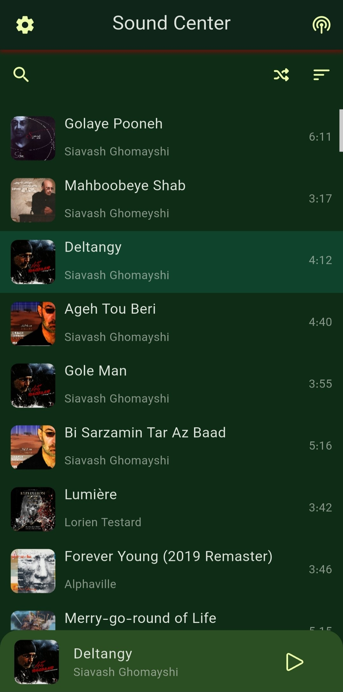
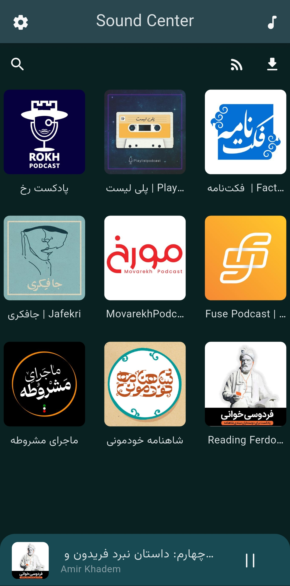
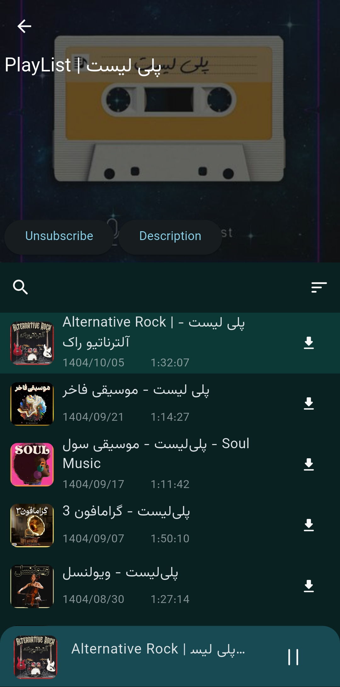
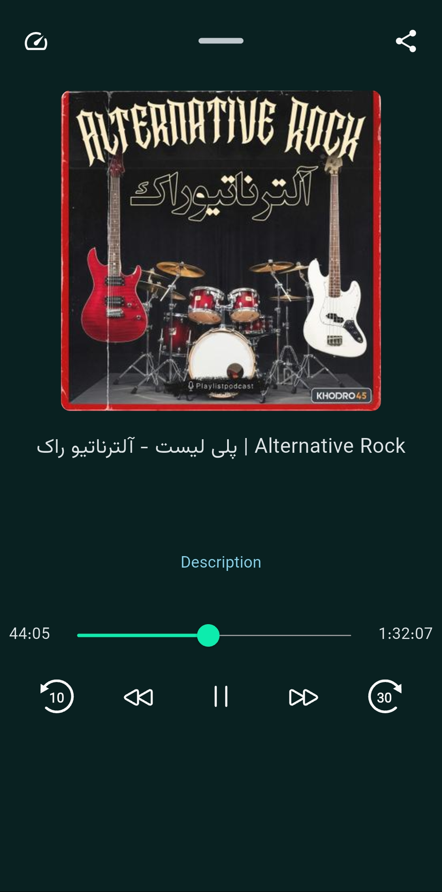
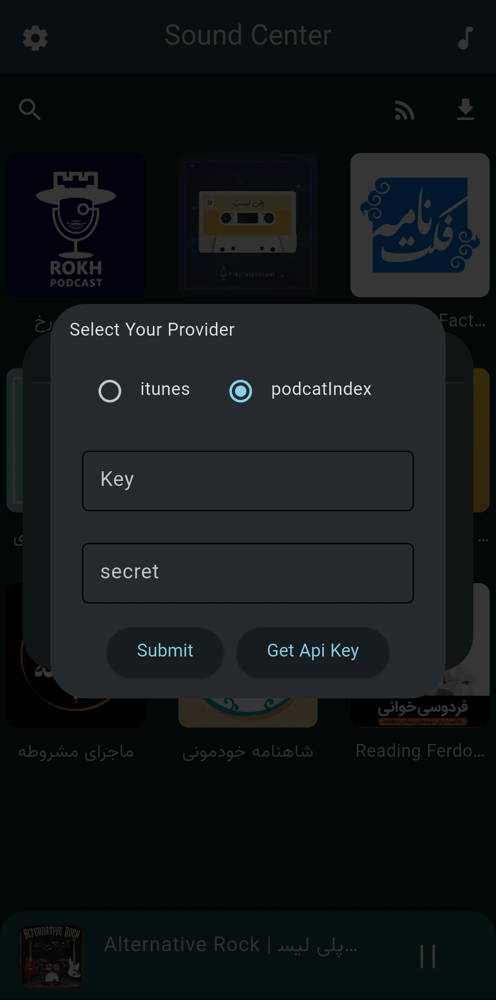
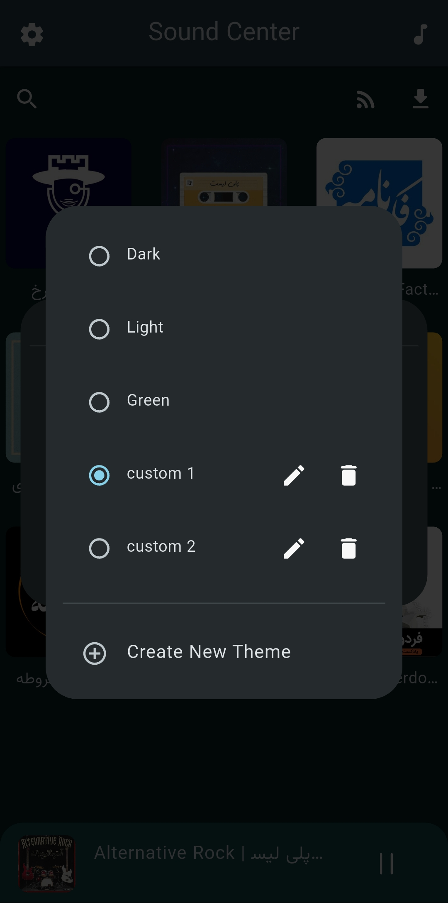
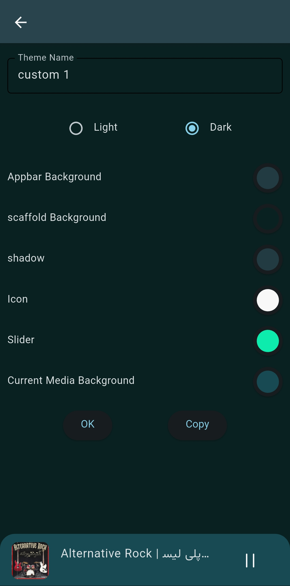
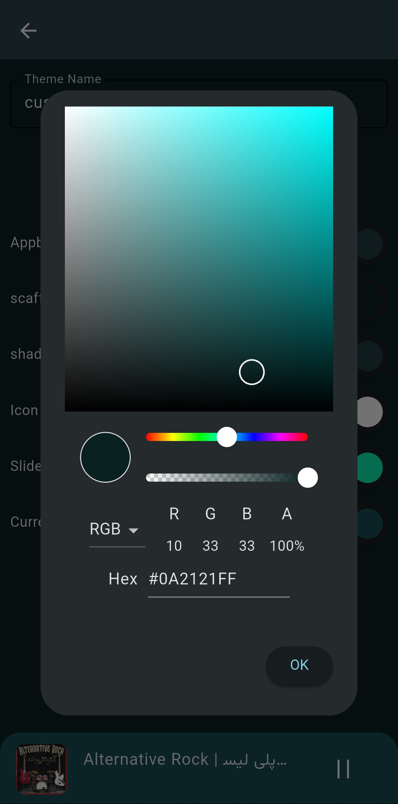

# Sound Center 🎵

---

**A simple and practical audio player built with Flutter**  
This app provides playback of local music, podcast search and streaming, offline downloads,
background playback, along with customization features.  
Currently available on Android and Linux desktop, with support for English and Farsi languages.

## Features

| Feature                                    | Status / Notes                             |
|--------------------------------------------|--------------------------------------------|
| **Local audio scanning & playback**        | ✔ Playlists, queue, seek, shuffle          |
| **Podcast search, streaming & downloads**  | ✔ Search, stream, offline resume           |
| **Background playback & system controls**  | ✔ `audio_service`, MPRIS on desktop        |
| **Downloads manager**                      | ✔ Background using `background_downloader` |
| **Localization**                           | ✔ English & Farsi (`intl`)                 |
| **Custom Themes**                          | ✔ Create Custom Themes and share them      |
| **Third-party sources (SoundCloud, etc.)** | 🔧 Planned — adapter-based architecture    |
| **Live audio streams (internet radio)**    | 🔧 Supported at player level, UI pending   |

## Screenshots

|  |  |  |  |
|------------------------------------------|------------------------------------------|------------------------------------------|------------------------------------------|
|  |  |  |  |

## Feedback & Support

Found a bug? Have a feature request?  
Please open an [Issue](https://github.com/azare77/sound_center/issues) or join the discussion!

### Short notes

- Architecture: modular features with BLoC for state management and a central `audio_handler` for
  playback orchestration.
- Permissions: the app requests storage/media permissions on first run to allow local scanning (
  `permission_handler`).
